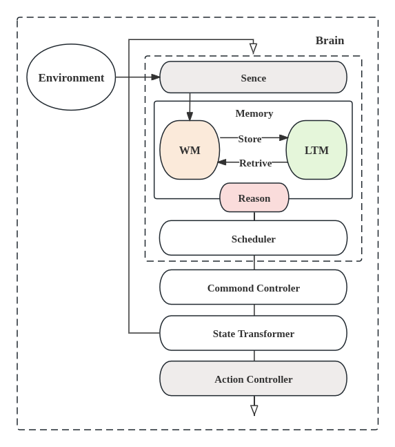
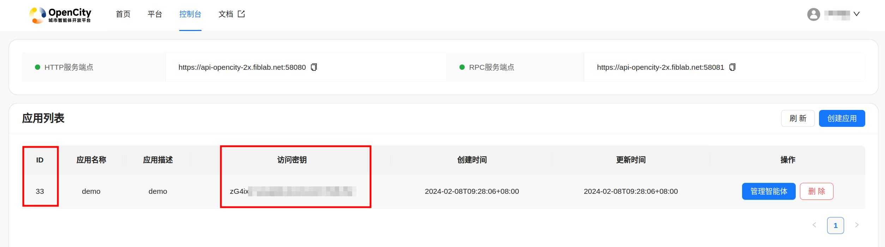

# Pycityagent

# Table of Contents
* [Introduction](#Introduction)
	* [The Whole Framework of CityAgent](#The-Whole-Framework-of-CityAgent)
	* [The Workflow of CityAgent](#The-Workflow-of-CityAgent)
* [Hands On - By An Easy Demo](#Hands-On---By-An-Easy-Demo)

<!-- TOC -->

## Introduction
### Framework of CityAgent
- 

### Workflow of CityAgent
- 

## Hands On - By An Easy Demo
### Apply for your App
- You first need to register your account in the [Opencity website](https://opencity.fiblab.net/)
- Login to the console, create your own app.
- Get your app_id and app_secret
    - 

### Get your Config
- There are three parts of a config file: **llm_request**, **citysim_request** and **apphub_request**
```yaml
llm_request:
  text_request:
    request_type: qwen
    api_key: xxx
    model: xxx
  img_understand_request:
    request_type: qwen
    api_key: xxx
    model: xxx
  img_generate_request:
    request_type: qwen
    api_key: xxx
    model: xxx

citysim_request:
  simulator: 
    server: https://api-opencity-2x.fiblab.net:58081
  map_request:
    mongo_coll: map_beijing_extend_20240205
    cache_dir: ./cache
  route_request: 
    server: http://api-opencity-2x.fiblab.net:58082
  streetview_request:
    engine: baidumap / googlemap
    mapAK: baidumap api-key (if you use baidumap engine)
    proxy: googlemap proxy (if you use googlemap engine)

apphub_request:
  hub_url: https://api-opencity-2x.fiblab.net:58080
  app_id: your APP ID
  app_secret: your APP Secret
  profile_image: the profile image of your agent
```
- Forget about **citysim_request**, let's focus on the other two.

#### LLM_REQUEST
- As you can see, the whole CityAgent is based on the LLM, by now, there are three different parts of config items: **text_request**, **img_understand_request** and **img_generate_request**
- By now, we support [**qwen**](https://tongyi.aliyun.com/) and [**openai**](https://openai.com/)
    - `Notice: Our environments are basically conducted with qwen. If you prefer to use openai, then you may encounter hardships. AND fell free to issue us.`
- Get your **api_key** and chooce your **model**s

#### CITYSIM_REQUEST
- Most of the configuration options in this part are determined, such as **simulator.server**, **map_request.mongo_coll**, **route_request.server**
- **map_request.cache_dir**: used for storing map data your machine, you can justify the target dir as you wish (**create the dir first**)
- **streetview_request**: used for obtaining streetview images, by now, we support baidumap engine and googlemap engine
  - if you choose baidumap engine, you need to get a baidumap api-key
    ``` yaml
    streetview_request:
      engine: baidumap
      mapAK: xxxx
    ```
  - if you choose googlemap engine, you need to provide your proxy address, for example:
    ``` yaml
    streetview_request:
      engine: googlemap
      proxy: 
        http: http://xxxx
        https: https://xxxx
    ```

#### APPHUB_REQUEST
- Used for creating the connection between backend server and client.
- Put your **app_id** and **app_secret** here.
  - Create your account and apply in [Opencity website](https://opencity.fiblab.net/)

### Installation
#### PyPI Installation
  - Install from **pip** easily.
  ```shell
  pip install pycityagent
  ```

#### Install from source code
- Clone this repo
- Install required packages
  ``` shell
  pip install -r requirements.txt
  ```
- Install **libGL.so.1**, if you ara using Linux with a suitable package manager: (apt for instance)
  ``` shell
  apt-get install libgl1
  ```

### CODE and RUN
- Check the **example** folder and copy files from it (`Remember replace the config file`)
- Look at the Demo: (A citizen Agent demo)
```python
import yaml
from pycityagent.simulator import Simulator
from pycityagent.urbanllm import LLMConfig, UrbanLLM
import asyncio
import time

async def main():
    # load your config
    with open('config_template.yaml', 'r') as file:
        config = yaml.safe_load(file)
    
    # get the simulator object
    smi = Simulator(config['citysim_request'])
    
    # get the person by person_id, return agent
    agent = await smi.GetCitizenAgent("name_of_agent", 8)

    # Help you build unique agent by scratch/profile
    agent.Image.load_scratch('scratch_template.json')

    # Load Memory and assist the agent to understand "Opencity"
    agent.Brain.Memory.Spatial.MemoryLoad('spatial_knowledge_template.json')
    agent.Brain.Memory.Social.MemoryLoad('social_background_template.json')

    # Connect to apphub so you can interact with your agent in front end
    agent.ConnectToHub(config['apphub_request'])
    agent.Bind()

    # Creat the soul (a LLM processor actually)
    llmConfig = LLMConfig(config['llm_request'])
    soul = UrbanLLM(llmConfig)

    # Add the soul to your agent
    agent.add_soul(soul)
    
    # Start and have fun with it!!!
    while True:
        await agent.Run()
        time.sleep(1)

if __name__ == '__main__':
    asyncio.run(main())
```

### Congratulations
- Following this "Hands On" guide, you have easily created an agent by your hand! 
- You can observe your AGENT in your console or in the [Opencity website](https://opencity.fiblab.net/).
- HAVE FUN WITH IT!