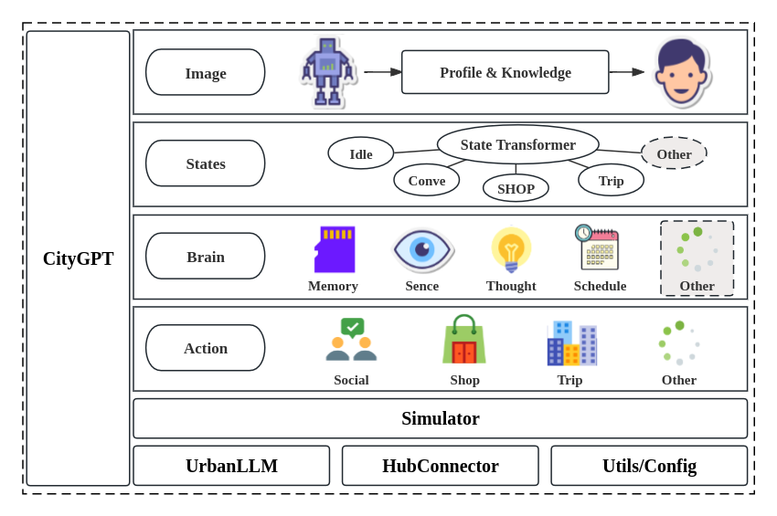

<div style="text-align: center; background-color: white; padding: 20px; border-radius: 30px;">
  
  <h1 style="color: black; margin: 0; font-size: 3em;">CityAgent: LLM Agents in City</h1>
</div>


# 🚀 CityAgent
 &ensp;
[](https://docs.fiblab.net/pycityagent) &ensp;


CityAgent is an advanced framework specifically designed for building intelligent agents in urban simulation environments. With CityAgent, you can easily create and manage agents, enabling complex urban scenarios to be modeled and simulated efficiently.

## 🌟 Features
- **Modular Design**: Plug-and-play components for agent behavior.
- **Urban Environment Simulation**: Built to simulate diverse urban scenarios.
- **LLM Integration**: Connects to language models for enriched agent behavior.
- **Flexible Configuration**: YAML-based configuration for easy customization.

## 📑 Table of Contents

1. [News](#news)
2. [Framework](#framework)
3. [Setup](#setup)
4. [QuickStart](#quickstart)
5. [Contributing](#contributing)
6. [License](#license)

<a id="news"></a>
## 📰 News

- 📢 **11.10** - Initial update is now live!
- 📢 **2.x version is not compatible* with 1.x version**

Stay tuned for upcoming updates!

<a id="framework"></a>
## 🛠️ Framework

CityAgent is built with a multi-layered architecture that allows users to create and manage intelligent agents for urban environments in a scalable and flexible manner. The framework is divided into several key layers, each responsible for different functionalities as depicted in the diagram below:



### Architectural Layers
- **Model Layer**: Handles agent configuration, task definitions, logging setup, and result aggregation.
  - **Task Configuration**: Defines agent behaviors and objectives.
  - **Unified Execution**: Centralized entry point for agent processes.

- **Agent Layer**: Implements multi-head workflows to manage agent actions.
  - **Memory**: Stores agent-related information, such as location and motion.
    - **Static Profiles**: Maintains unchanging agent attributes.
    - **Custom Data Pool**: Functions as a working memory.
  - **Multi-Head Workflow**: Supports both normal and event-driven modes.
    - **Reason Block**: Utilizes LLMs to determine decisions based on context and tools.
    - **Route Block**: Chooses the best path based on defined criteria using LLMs or rules.
    - **Action Block**: Executes actions as per defined contexts and tools.

- **Message Layer**: Facilitates agent communication through peer-to-peer (P2P), peer-to-group (P2G), and group chats.

- **Environment Layer**: Manages interaction with the urban environment.
  - **Environment Sensing**: Reads data from the environment.
  - **Interaction Handling**: Writes or modifies environmental states.
  - **Message Management**: Handles incoming and outgoing agent messages.

- **LLM Layer**: Provides configuration and integration for using LLMs in the agent's workflow.
  - **Prompting & Execution**: Supports model invocation and monitoring.
  - **Model Support**: Compatible with various LLMs, such as OpenAI, Qwen, Deepseek, etc.

- **Tool Layer**: Provides additional utilities to the agents.
  - **String Processing**: Handles parsing and formatting.
  - **Result Analysis**: Parses responses in formats like JSON or dictionaries.
  - **Data Storage & Retrieval**: Includes ranking and search tools.

<a id="setup"></a>
## ⚙️ Setup

You can set up CityAgent in two different ways:

### 1. From Scratch

Follow these steps to set up CityAgent from scratch by cloning the repository. The project is built using Python and managed with Poetry.

1. **Clone the Repository**
   ```bash
   git clone [This Repository]
   ```
2. **Navigate to the Project Directory**
   ```bash
   cd pycityagent
   ```
3. **Install Poetry** (if not installed)
   ```bash
   curl -sSL https://install.python-poetry.org | python3 -
   ```
4. **Install Dependencies**
   ```bash
   poetry install
   ```
5. **Activate the Virtual Environment**
   ```bash
   poetry shell
   ```

### 2. Install via pip

This method is not yet available. Stay tuned for future updates!

<a id="quickstart"></a>
## 🚀 QuickStart

Get started with CityAgent in just a few minutes!

### 1. Config Configuration
CityAgent uses a configuration file written in `.yaml` format to manage settings for various components. Below is a sample configuration file (`config_template.yaml`) that showcases the structure:

```yaml
llm_request:
  text_request:
    request_type: openai
    api_key: <YOUR_API_KEY>
    model: gpt-4o
  img_understand_request:
    request_type: none
    api_key: none
    model: none
  img_generate_request:
    request_type: none
    api_key: none
    model: none

simulator_request:
  simulator:
    server: https://api-opencity-2x.fiblab.net:58081
  map_request:
    mongo_uri: <MONGO_URI>
    mongo_db: llmsim
    mongo_coll: map_beijing5ring_withpoi_0424
    cache_dir: ./cache
  route_request:
    server: http://api-opencity-2x.fiblab.net:58082
  streetview_request:
    engine: baidumap / googlemap
    mapAK: baidumap api-key (if you use baidumap engine)
    proxy: googlemap proxy (if you use googlemap engine)
```

### 2. Example Usage
To get started quickly, please refer to the `examples` folder in the repository. It contains sample scripts and configurations to help you understand how to create and use agents in an urban simulation environment.

<a id="contributing"></a>
## 🤝 Contributing
We welcome contributions from the community!.

<a id="license"></a>
## 📄 License

CityAgent is licensed under the MIT License. See the [LICENSE](LICENSE) file for more details.

---

Feel free to reach out if you have any questions, suggestions, or want to collaborate!

---

> **Follow us**: Stay updated with the latest news and features by watching the repository.

---
